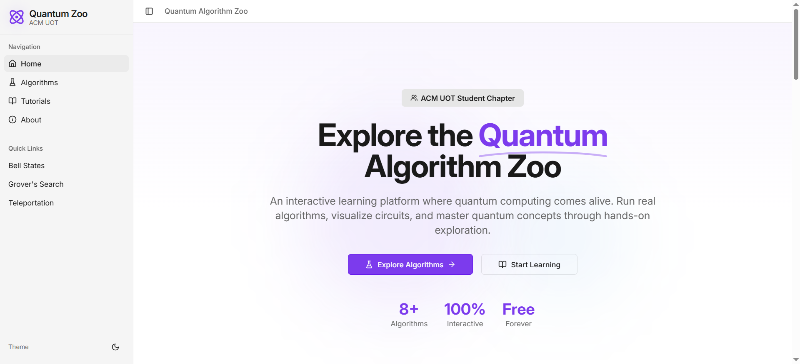
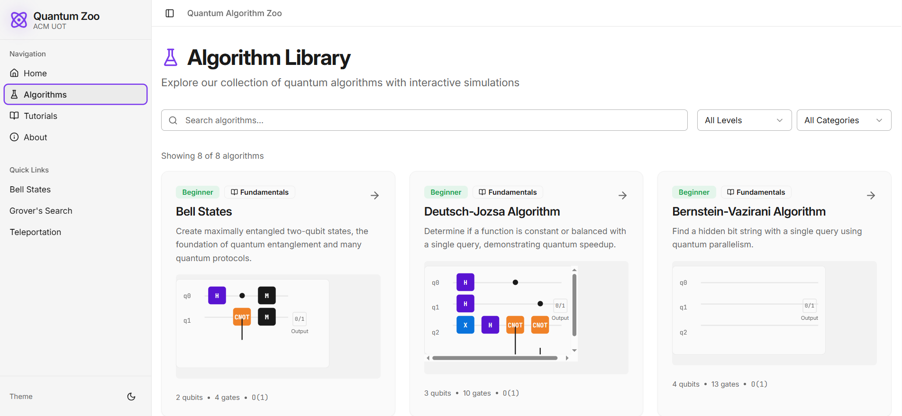
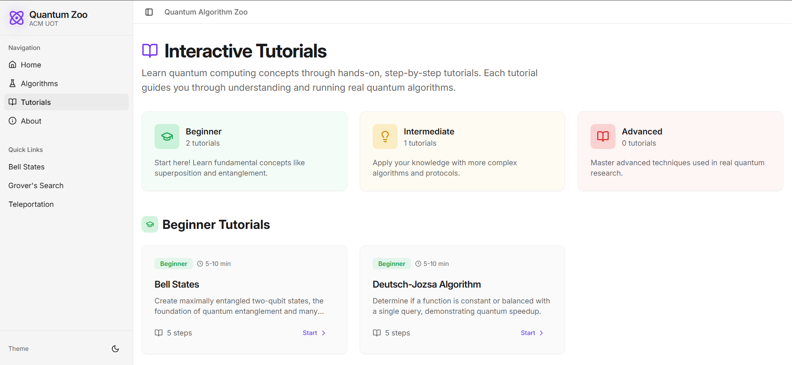
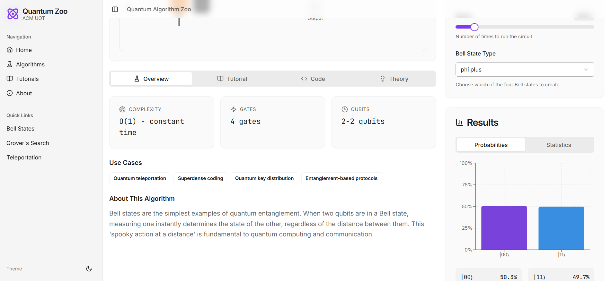

# **Quantum Algorithm Zoo**

[](https://opensource.org/licenses/MIT)
[](https://github.com/ACM-UOT)
[](https://qiskit.org)
[](https://www.typescriptlang.org)
[](https://reactjs.org)

> An interactive educational platform for exploring quantum computing algorithms through hands-on simulation and visualization. Built by the **ACM Student Chapter at University of Tripoli** as part of the "Year of Quantum" initiative.






## code documentation

[Documentation](documentation.md)

> *Note: The live demo requires the backend server to be running locally (see Setup below)*

## Overview

**Quantum Algorithm Zoo** is a comprehensive educational platform designed to make quantum computing accessible to students, researchers, and enthusiasts. Unlike static tutorials, our platform provides:

- **Interactive simulations** of quantum algorithms
- **Real-time visualizations** of quantum state evolution
- **Step-by-step explanations** with mathematical foundations
- **Comparative analysis** between quantum and classical approaches
- **Code generation** for immediate experimentation

Built with educational principles in mind, Quantum Zoo prioritizes clarity and hands-on learning, making it perfect for academic settings and self-study.

## Features

### Educational
- **8+ Quantum Algorithms** - From Bell States to Shor's Algorithm
- **Beginner to Advanced Pathways** - Structured learning progression
- **Interactive Tutorials** - Learn by doing with guided exercises
- **Mathematical Foundations** - Clear explanations of underlying theory

### Interactive
- **Live Circuit Visualizations** - See quantum gates in action
- **Parameter Controls** - Adjust qubits, iterations, and settings
- **Real-time Results** - Immediate feedback from simulations
- **State Evolution Animation** - Watch quantum states transform

### Practical
- **Qiskit Integration** - Real quantum simulations using IBM's framework
- **Code Export** - Generate and download complete Python/Qiskit code
- **Multiple Backends** - Run on simulators or real quantum hardware
- **Benchmarking Tools** - Compare algorithm performance

### User Experience
- **Dark/Light Mode** - Comfortable viewing in any environment
- **Responsive Design** - Works on desktop, tablet, and mobile
- **Accessible Interface** - Designed for diverse learners
- **ACM UOT Branding** - Academic styling with institutional identity

## Tech Stack

### Frontend
- **React 18** with TypeScript for type-safe development
- **Tailwind CSS** + **Shadcn UI** for modern, accessible components
- **Recharts** for interactive data visualizations
- **Wouter** for lightweight client-side routing
- **TanStack Query** for efficient data fetching and caching
- **React-Hook-Form** + **Zod** for robust form validation

### Backend
- **Node.js** + **Express** for API server
- **Python 3.9+** with **Qiskit 0.40+** for quantum simulations
- **Qiskit Aer** for high-performance quantum circuit simulation
- **Flask** (optional) for Python API endpoints

### Development & Deployment
- **Vite** for fast development and optimized builds
- **Docker** for containerized deployment
- **GitHub Actions** for CI/CD pipelines
- **Jest** + **React Testing Library** for comprehensive testing

## Project Structure

```
quantum-algorithm-zoo/
├── client/                          # React frontend application
│   ├── src/
│   │   ├── components/              # Reusable React components
│   │   │   ├── algorithm-card.tsx   # Algorithm selection cards
│   │   │   ├── circuit-visualizer.tsx # Quantum circuit display
│   │   │   ├── code-display.tsx     # Syntax-highlighted code viewer
│   │   │   ├── navigation.tsx       # Main navigation component
│   │   │   ├── parameter-controls.tsx # Interactive algorithm controls
│   │   │   ├── results-dashboard.tsx # Simulation results display
│   │   │   ├── theme-toggle.tsx     # Dark/light mode switcher
│   │   │   └── tutorial-viewer.tsx  # Interactive tutorial component
│   │   ├── lib/
│   │   │   ├── algorithms.ts        # Algorithm definitions & metadata
│   │   │   ├── tutorials/           # Markdown tutorial content
│   │   │   ├── theme.tsx            # Theme context and providers
│   │   │   └── utils.ts             # Utility functions
│   │   ├── pages/
│   │   │   ├── home.tsx             # Landing page
│   │   │   ├── algorithms.tsx       # Algorithm gallery
│   │   │   ├── algorithm-detail.tsx # Individual algorithm page
│   │   │   ├── tutorials.tsx        # Tutorials listing
│   │   │   ├── playground.tsx       # Custom circuit builder
│   │   │   ├── about.tsx            # About ACM UOT page
│   │   │   └── contribute.tsx       # Contribution guidelines
│   │   ├── types/                   # TypeScript type definitions
│   │   └── App.tsx                  # Main application component
│   ├── public/                      # Static assets
│   └── package.json
│
├── server/                          # Express backend server
│   ├── src/
│   │   ├── routes/                  # API route handlers
│   │   │   ├── algorithms.ts        # Algorithm management endpoints
│   │   │   ├── execution.ts         # Quantum execution endpoints
│   │   │   └── tutorials.ts         # Tutorial content endpoints
│   │   ├── services/
│   │   │   └── quantum-service.ts   # Quantum simulation service
│   │   ├── middleware/              # Express middleware
│   │   ├── utils/                   # Server utilities
│   │   └── index.ts                 # Server entry point
│   ├── quantum/                     # Python quantum simulation engine
│   │   ├── simulator.py             # Qiskit simulation wrapper
│   │   ├── algorithms/              # Python implementations
│   │   ├── utils/                   # Quantum utilities
│   │   └── requirements.txt         # Python dependencies
│   └── package.json
│
├── shared/                          # Shared code between frontend/backend
│   └── schema.ts                    # TypeScript type definitions
│
├── docs/                            # Project documentation
│   ├── algorithms/                  # Detailed algorithm explanations
│   ├── api/                         # API documentation
│   ├── tutorials/                   # Extended tutorials
│   └── development.md               # Development guide
│
├── docker/                          # Docker configuration
│   ├── Dockerfile.client            # Frontend Dockerfile
│   ├── Dockerfile.server            # Backend Dockerfile
│   └── docker-compose.yml           # Development environment
│
├── .github/workflows/               # GitHub Actions workflows
│   ├── ci.yml                       # Continuous integration
│   └── deploy.yml                   # Deployment automation
│
├── package.json                     # Root package.json (monorepo)
├── tsconfig.json                    # TypeScript configuration
├── vite.config.ts                   # Vite build configuration
└── README.md                        # You are here! 📍
```

## Available Algorithms

| Algorithm | Difficulty | Description | Key Concepts |
|-----------|------------|-------------|--------------|
| **Bell States** | Beginner | Create maximally entangled qubit pairs | Entanglement, Superposition |
| **Deutsch-Jozsa** | Beginner | Determine if a function is constant or balanced | Quantum parallelism, Oracle |
| **Bernstein-Vazirani** | Beginner | Find a hidden bit string in one query | Phase kickback, Inner product |
| **Superdense Coding** | Beginner | Transmit 2 classical bits with 1 qubit | Entanglement, Quantum communication |
| **Quantum Teleportation** | Intermediate | Transfer quantum state without transmission | Entanglement, Measurement |
| **Grover's Search** | Intermediate | Quadratic speedup for database search | Amplitude amplification, Oracle |
| **Quantum Fourier Transform** | Advanced | Basis transformation for many algorithms | Phase estimation, Period finding |
| **Phase Estimation** | Advanced | Estimate eigenvalues of unitary operators | QFT, Eigenvalue estimation |

*More algorithms coming soon!*

## API Documentation

### **Base URL**
```
http://localhost:5000/api
```

### **Endpoints**

#### **GET /api/algorithms**
List all available algorithms.

**Response:**
```json
{
  "algorithms": [
    {
      "id": "bell-states",
      "name": "Bell States",
      "description": "Create maximally entangled qubit pairs",
      "difficulty": "beginner",
      "qubits": [2],
      "parameters": [
        {
          "name": "bellType",
          "type": "select",
          "options": ["phi_plus", "phi_minus", "psi_plus", "psi_minus"],
          "default": "phi_plus"
        }
      ]
    }
  ]
}
```

#### POST /api/execute
Execute a quantum algorithm simulation.

**Request:**
```json
{
  "algorithmId": "grover-search",
  "qubits": 3,
  "shots": 1024,
  "parameters": {
    "searchItems": ["101"],
    "iterations": 2
  }
}
```

**Response:**
```json
{
  "success": true,
  "result": {
    "counts": {"000": 122, "001": 138, "101": 512, "110": 252},
    "probabilities": {"000": 0.119, "001": 0.135, "101": 0.5, "110": 0.246},
    "histogramData": [...],
    "circuitDiagram": "base64_encoded_svg",
    "executionTime": 245,
    "shots": 1024
  },
  "qiskitCode": "from qiskit import QuantumCircuit, Aer, execute\n..."
}
```

#### GET /api/health
Health check endpoint.

**Response:**
```json
{
  "status": "healthy",
  "timestamp": "2024-01-15T10:30:00Z",
  "version": "1.0.0"
}
```

## Getting Started

### Prerequisites
- Node.js 18+ and npm
- Python 3.9+ and pip
- Git

### Quick Start (Development)

1. **Clone the repository**
   ```bash
   git clone https://github.com/ACM-UOT/quantum-algorithm-zoo.git
   cd quantum-algorithm-zoo
   ```

2. **Install dependencies**
   ```bash
   # Install root dependencies
   npm install

   # Install client dependencies
   cd client
   npm install

   # Install server dependencies
   cd ../server
   npm install

   # Install Python quantum dependencies
   cd quantum
   pip install -r requirements.txt
   ```

3. **Set up environment variables**
   ```bash
   cp .env.example .env
   # Edit .env with your configuration
   ```

4. **Start the development servers**
   ```bash
   # From the project root
   npm run dev
   ```
   This starts:
   - Frontend on `http://localhost:3000`
   - Backend on `http://localhost:5000`

5. **Open your browser**
   Navigate to `http://localhost:3000` to start exploring quantum algorithms!

### Docker Deployment

1. **Build and run with Docker Compose**
   ```bash
   docker-compose up --build
   ```

2. **Access the application**
   - Frontend: `http://localhost:3000`
   - Backend API: `http://localhost:5000`

### Production Deployment

1. **Build the application**
   ```bash
   npm run build
   ```

2. **Start the production server**
   ```bash
   npm start
   ```

## Contributing

We welcome contributions from the quantum computing community! Whether you're adding new algorithms, improving tutorials, or fixing bugs, your help is appreciated.

### How to Contribute

1. **Fork the repository**
2. **Create a feature branch**
   ```bash
   git checkout -b feature/amazing-algorithm
   ```
3. **Make your changes**
4. **Run tests**
   ```bash
   npm test
   ```
5. **Submit a pull request**

### Contribution Areas
- **New Algorithms**: Implement additional quantum algorithms
- **Tutorials**: Create educational content in English or Arabic
- **Visualizations**: Improve quantum state visualizations
- **Documentation**: Enhance documentation and examples
- **Translation**: Help translate the interface to Arabic


## Learning Resources

### For Beginners
- [Qiskit Textbook](https://qiskit.org/textbook) - Comprehensive quantum computing textbook
- [Quantum Computing for the Very Curious](https://quantum.country/qcvc) - Interactive quantum mechanics primer
- [Our Tutorials](/tutorials) - Step-by-step guides for each algorithm

### For Developers
- [Qiskit Documentation](https://qiskit.org/documentation/) - Official Qiskit API docs
- [Quantum Algorithm Implementations](https://github.com/quantumlib/Cirq/tree/master/examples) - Reference implementations
- [Quantum Computing Stack Exchange](https://quantumcomputing.stackexchange.com/) - Q&A community

### For Researchers
- [Quantum Algorithm Zoo](https://quantumalgorithmzoo.org/) - Comprehensive list of quantum algorithms
- [arXiv Quantum Physics](https://arxiv.org/list/quant-ph/recent) - Latest research papers
- [Quantum Open Source Foundation](https://qosf.org/) - Open source quantum projects

## ACM UOT Team

**Contributors:**
- Feras Shita - Tech lead

**Faculty Advisor:**
- Adnan Alshrief - Department of Computer Science

## About ACM UOT

The **ACM Student Chapter at University of Tripoli** is dedicated to advancing computing as a science and profession. We organize workshops, hackathons, and research projects to foster innovation and learning among students.

**Join us:**
- **Email**: uotacm@gmail.com
- **Website**: [https://uot.acm.org](https://uot.acm.org/)

## License

This project is licensed under the MIT License - see the [LICENSE](LICENSE) file for details.

## Acknowledgments

- **IBM Qiskit Team** for creating an amazing quantum computing framework
- **University of Tripoli** for supporting student initiatives
- **All Contributors** who have helped make this project better
- **The Quantum Computing Community** for inspiration and resources

## Contact & Support

- **Issues**: [GitHub Issues](https://github.com/ACM-UOT/quantum-algorithm-zoo/issues)
- **Discussions**: [GitHub Discussions](https://github.com/ACM-UOT/quantum-algorithm-zoo/discussions)
- **Email**: uotacm@gmail.com

---

<p align="center">
  <em>Made with ❤️ by the ACM Student Chapter at University of Tripoli</em><br>
  <em>Part of the "Year of Quantum" Initiative • 2025</em>
</p>
